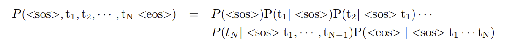

# Pre-Code Notes:

## Masked Self Attention

*What is Attention?*\
It refers to the idea that the system can focus on specific elements within a larger dataset. It allows the model to focus on specific parts more than others based on learned weighting of this input. 

### Types of Attention:

> **Self-attention:** Represents importance within the sequence itself
>
> **Masked Self-attention:**
> Causal Mask: Presents the viewing of future sequences (like in sentences)
> Padding Mask: Covers padding tokens
> Localized Mask: Only allows you to see a nearby region around token
>
> **Cross-attention:** Finds relationships between two sequences (helpful in translation)
>
> **Multi-head attention:** a lot of attention mechanisms, assuming different heads will learn difference trends

### Self-Attention w/ Causal Additive Mask:

*Keys*\
Representations of the input that the model needs to pay attention to. **They decide how each part of the input relates to that focus.**

*Queries*\
Also derived from the input. They are specifically encoding what the model should look for in the input. They focus on **what is currently important** in generating the next word in a sentence.

*Values*\
Also derived from the input. They contain the actual information the model is interested in. Values are associated with keys. This embeds the content at particular locations. When queries and keys match closely the values with the keys are given more importance in the output. **Values provide the content that is brought into focus, once the keys have aligned with the queries.**

## Language Modeling

We are using a language model to describe the most likely output sequence given an input sequence. The reason for this is that the number of outcomes is infinite. This is similar to a DQN, where we used a NN to approximate a Q-table. Now we are using it to approximate the distribution of textual outputs given our input. 

**Probability of a Complete Token Sequence:**
This is decomposed using bayes rule, which makes sense. The probability of seeing them all together is the same as seeing each one inidividually given its predecessors. 

### Token Embeddings
One-hot vector is wasteful. We would need an absurdly high-dimension space to represent a vocab of 1 million words. **The solution is to linearly project the one-hot vector into a lower dimensional space using a learned linear layer.**

### Maximum Likelihood Estimation
Very generic process for estimating a parametric probability distribution for a random variable from training data. For this situation, we looking to find the model that maximizes the probability of seeing the training data.\

Often the data can be viewed as independent so you can maximize the product sum of seeing all of the training instances. However log converts products to sums! This gives us the final formulation:\

# Implementation Notes:

## Masked-Self Attention
- Keys, queries, and values all project the input into a different latent space with their own weight matrix Wkey, Wvalue, or Wquery
- Keys and queries have the same dimensionality
- Attention refers to multiplying the Queries and the Keys
- Self-attention is unique in that we are focused on trying to figure out which part of the input is most important at this current time. 
- Dot product between K, Q allows you to figure out how similar they are (think cosine similarity) which tells you what to pay attention to
- This is then multiplied with the values to scale the attention by which values they correspond to. 